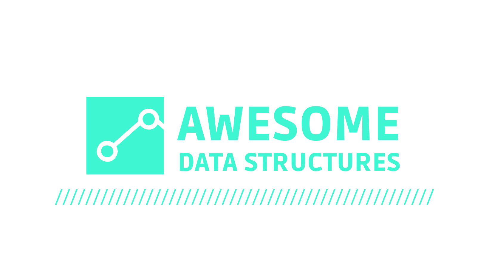

<p align="center">
    <a href="#" alt="Version">
        
    </a>
    <a href="#" alt="Coverage">
        
    </a>
    <a href="#" alt="Contributors">
        
    </a>
    <a href="#" alt="Forks">
        
    </a>
    <a href="#" alt="Stars">
        
    </a>
    <a href="#" alt="Issues">
        
    </a>
    <a href="#" alt="License">
        
    </a>
</p>

## About The Project

Awesome Data Structures is an npm package that brings together all tha main ready-to-use data structures. It's lightweight, it's performative and has no dependencies.

With this package, you can build efficient applications, using the right data structures, or learn more about complexity, algorithms and data structures by reading our documentation.

## Getting Started

Awesome Data Structures is an easy-to-use application. Regardless of which data structure you want to use, you just need to import the desired class and initialize it. 

## Supported Data Structures
- LinkedList
    - SinglyLinkedList
    - DoublyLinkedList
    - CircularLinkedList
- Stacks
- Queue
- Deque
- BST

### Installation

```
npm install awesome-data-structures
```

### Usage
```
import { SinglyLinkedList } from 'awesome-data-structures'

const list = new SinglyLinkedList()
```

## Documentation
Please check our docs by [clicking here](https://github.com/letsaguiar/awesome-data-structures/wiki)

## Contributing
We want this package to be as useful, robust and scalable as possible. We're always maintaining it and adding new features, so feel free to open issues and pull requests. **Any help is welcome**.

If you have a suggestion that would make this better, please fork the repo and create a pull request. You can also simply open an issue. Don't forget to give the project a star! Thanks again!

1. Fork the Project
2. Create your Feature Branch (`git checkout -b feature/AmazingFeature`)
3. Commit your Changes (`git commit -m 'Add some AmazingFeature'`)
4. Push to the Branch (`git push origin feature/AmazingFeature`)
5. Open a Pull Request

## License

Distributed under the MIT License. [Click here](LICENSE.md) for more information.